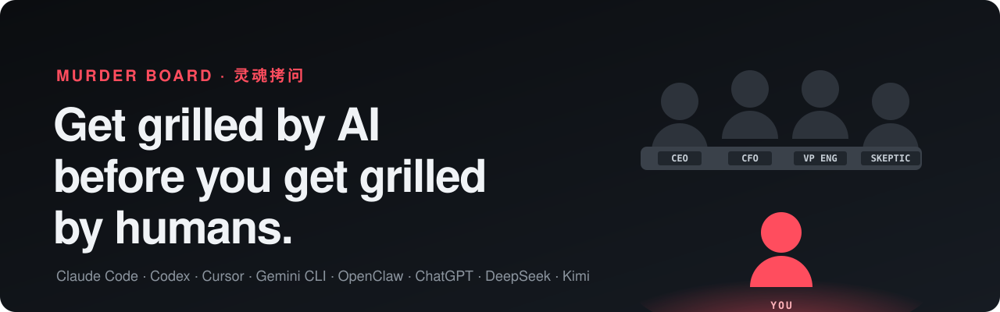

<div align="center">



**English** · [简体中文](README.zh-CN.md) · [Try it in your browser](https://mbappewu.github.io/murder-board/)

[](skills)
[](#install)
[](LICENSE)
[](https://github.com/MbappeWU/murder-board/stargazers)

</div>

The Pentagon doesn't send a general to testify before Congress without a **murder board**: a panel whose only job is to ask the most brutal questions first. NASA runs them before flight reviews. PhD advisors run them before defenses.

**Now you get one before Monday's meeting.** It reads your deck, works out the questions most likely to sink you, grills you one question at a time, scores every answer, and hands you a prep sheet.

<div align="center">

</div>

## Install

**Claude Code, Codex, Cursor, Gemini CLI, Copilot, OpenCode, OpenClaw and 40+ other agents**

```bash
npx skills add MbappeWU/murder-board
```

Or paste this into your agent:

```text
Install the murder-board skills from https://github.com/MbappeWU/murder-board (follow INSTALL.md)
```

<details>
<summary><b>Claude Code plugin</b> · <b>Claude.ai</b> · <b>ChatGPT, Gemini, DeepSeek, Kimi and other chat apps</b></summary>

**Claude Code plugin marketplace**

```text
/plugin marketplace add MbappeWU/murder-board
/plugin install murder-board@murder-board
```

**Claude.ai:** download `murder-board.zip` from the [latest release](https://github.com/MbappeWU/murder-board/releases/latest) and upload it in *Settings → Capabilities → Skills*.

**Any chat AI (no install):** use the [web page](https://mbappewu.github.io/murder-board/), or copy a portable prompt into the chat, a Project, a custom GPT or a Gem:
[murder-board](portable/en/murder-board.md) · [pre-mortem](portable/en/pre-mortem.md) · [boardroom](portable/en/boardroom.md) · [so-what](portable/en/so-what.md) · [sparring](portable/en/sparring.md) · [中文版](portable/zh-CN)

**Manual:** copy the folders in [`skills/`](skills) into your agent's skills directory (see [INSTALL.md](INSTALL.md)).
</details>

Then just ask:

```text
murder-board: grill me before Thursday's exec review. Deck: ./q3-plan.pdf
```

## How it works

| | Step | What happens |
|---|---|---|
| 🔎 | **Recon** | Reads your deck, doc, PRD or resume like an opponent: the ask, numbers that don't reconcile across slides, the assumptions, what's missing, and what the room already believes. |
| 🪑 | **The panel** | Seats 3–5 people who would really be in that room (a CFO, a skeptic, your boss), each with an agenda and a signature move. Describe your real boss and they get a seat. |
| 🎯 | **The kill list** | Drafts 15–25 questions ranked by **Kill Score** = likelihood × damage. You don't see it until the end, just like the real thing. |
| 🔥 | **The drill** | One question at a time, in character. Dodge and it follows up ("That's not what I asked."). Ramble on Brutal and it interrupts. |
| 📋 | **Score cards** | Every answer scored on **Directness · Evidence · Honesty · Brevity · Composure**, with a *"Say this instead"* rewrite in your own voice. |
| 🧾 | **Prep sheet** | A readiness score, the 3 landmines, 10 must-nail answers, what to bring, what to cut from your deck, your first 30 seconds and your bad habits. |

Three difficulties: **Friendly**, **Realistic**, **Brutal**. Say `pause` at any time to step out and get coaching. Short on time? **Quick mode** gives you the top-10 kill list with model answers in one shot.

📖 **[Read a full example session →](examples/exec-review.md)**

## Presets

Pick one, or just describe the room.

| Moment | Preset | Default panel |
|---|---|---|
| Leadership review | `exec-review` | Boss · CFO · Operator · Skeptic |
| Budget or headcount ask | `budget-ask` | CFO · Boss · Operator · Peer stakeholder |
| Justifying your team's efficiency | `efficiency-review` | Skeptical exec · HR · CFO · Technical expert |
| Board meeting or QBR | `board-meeting` | Investor · Independent director · CFO · Operator |
| Investor pitch | `investor-pitch` | Lead partner · Skeptical partner · Operator partner |
| Job interview | `job-interview` | Hiring manager · Bar raiser · Future peer |
| Promotion committee | `promo-committee` | Chair · Skip-level · Skeptic · HR |
| Thesis or PhD defense | `thesis-defense` | Chair · Methods expert · Outside member |
| Design or architecture review | `design-review` | Principal engineer · On-call owner · Security |
| PRD or launch review | `product-review` | Product lead · Customer · Engineering · Data |
| Sales pitch | `sales-pitch` | Economic buyer · Skeptical boss · End user · Procurement |
| All-hands Q&A | `all-hands` | Two employees · HR · Skeptic |
| Press or crisis | `press` | Journalist · Skeptic · Legal |
| 述职 · 竞聘 · 立项评审 · 结构化面试 · 考研复试 | Chinese presets | Run entirely in Chinese |

## The rest of the kit

Four companion skills with the same philosophy: **be hard on the plan now so reality doesn't have to be.**

| Skill | Use it when | What you get |
|---|---|---|
| [**pre-mortem**](skills/pre-mortem/SKILL.md) | You're about to commit to a plan | "It's six months later and it failed. Why?" Failure stories from every angle, early-warning signals, tripwires, and the assumptions to test this week. A team facilitation kit too. |
| [**boardroom**](skills/boardroom/SKILL.md) | You face a hard decision | A personal board of five directors who disagree with each other and with you. Independent memos, cross-examination, a vote with dissent, and the Chair's verdict. |
| [**so-what**](skills/so-what/SKILL.md) | You're writing for busy executives | Your update, email or report rebuilt answer-first (Pyramid Principle), in 3 lengths, with a red-pen report of what was cut and why. |
| [**sparring**](skills/sparring/SKILL.md) | A hard 1:1 conversation is coming | The AI plays the other person (raise, feedback, layoff, negotiation, resignation), reacts to exactly what you say, then scores you and writes your script. |

## Why it works

- **It won't flatter you.** Assistants are trained to agree with you. The room won't. These skills are built to disagree first.
- **Specific, not theatrical.** It quotes your numbers and your slides. "Slide 7 says 40% margin, slide 12 implies 22%. Which is it?" beats generic toughness.
- **It audits the document too.** Contradictory numbers, promised-but-missing data, and footnotes that quietly undercut your own case.
- **It never invents your facts.** Model answers use `[placeholders]` for anything you haven't told it.
- **Your language, your room.** Speak Chinese and the whole board speaks Chinese, with presets for 述职, 竞聘 and 立项评审.
- **Just Markdown.** No server, no API key, no telemetry. It runs inside the AI you already use.

## FAQ

<details><summary><b>Isn't this just a prompt?</b></summary>

It's a structured workflow in plain Markdown: recon, panel design, Kill Score ranking, a drill protocol, a calibrated rubric and a prep-sheet format, plus libraries of panel archetypes and scenario presets. Read it all in [`skills/murder-board`](skills/murder-board). That it's plain text is a feature: you can read it, fork it and tune it for your own company.
</details>

<details><summary><b>Is it too harsh?</b></summary>

Pick **Friendly** for a first run, or if you're nervous. The rules forbid personal attacks: pressure goes on the argument, never on you. Say `pause` at any moment to step out of the room.
</details>

<details><summary><b>Which model should I use?</b></summary>

Any capable model works. Stronger reasoning models produce sharper kill lists. Voice mode (ChatGPT, Claude, Gemini, Doubao) makes the drill feel like the real room.
</details>

<details><summary><b>Is my deck sent anywhere?</b></summary>

Not by this repo. The skills are text files that run inside your own AI tool, under that tool's privacy terms.
</details>

## Contributing

The best additions are **presets** (who sits on the panel for *your* high-stakes moment) and **killer questions** (the question that actually sank someone). Open an issue with the template, or send a PR. See [CONTRIBUTING.md](CONTRIBUTING.md).

## Star history

<a href="https://star-history.com/#MbappeWU/murder-board&Date">
  
</a>

**If it saves you from one bad meeting, a ⭐ helps the next person find it.**

## License

[MIT](LICENSE) © MbappeWU
